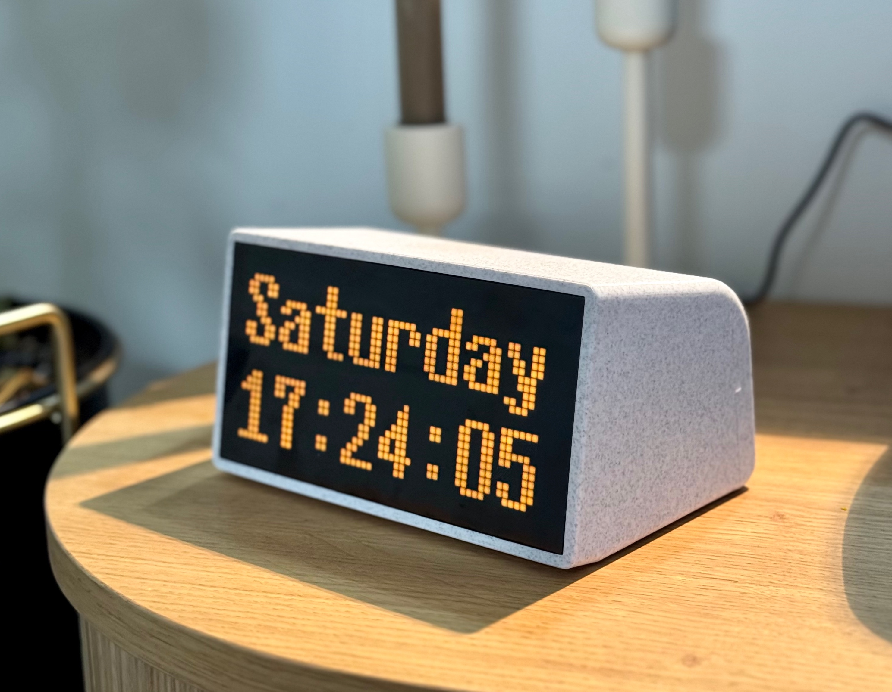
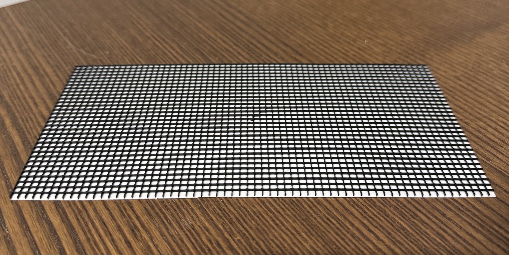
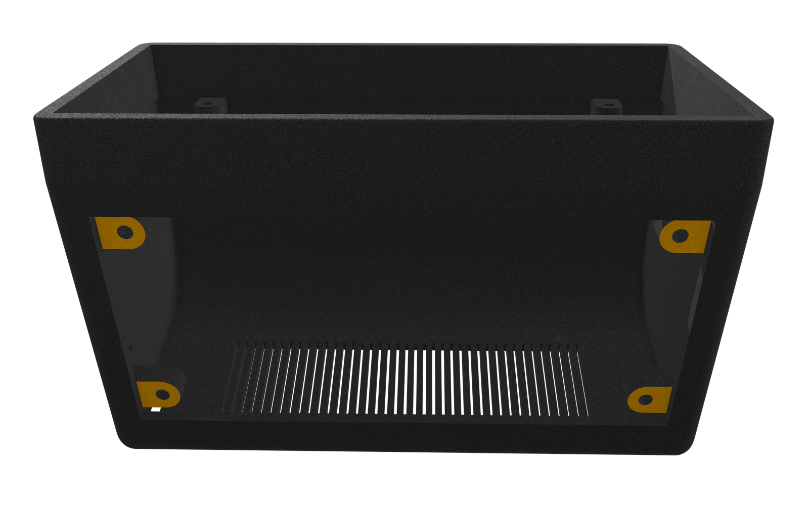
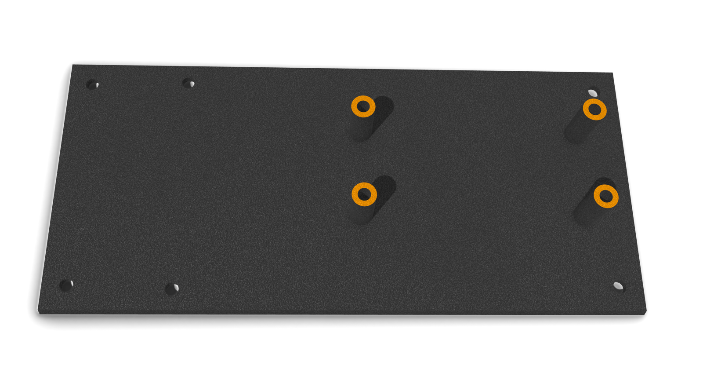
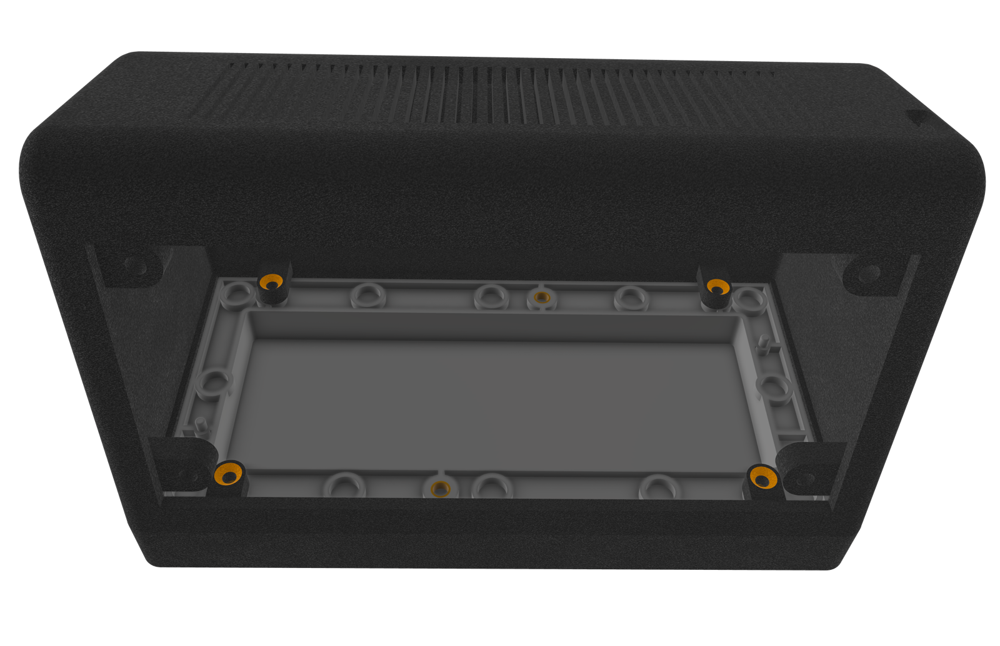
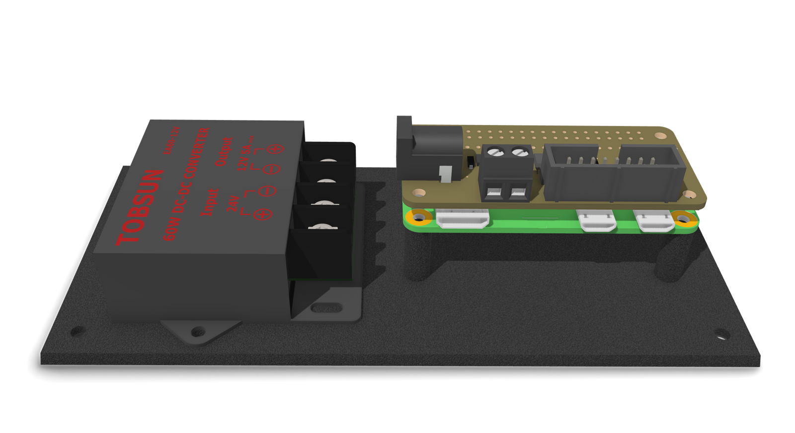
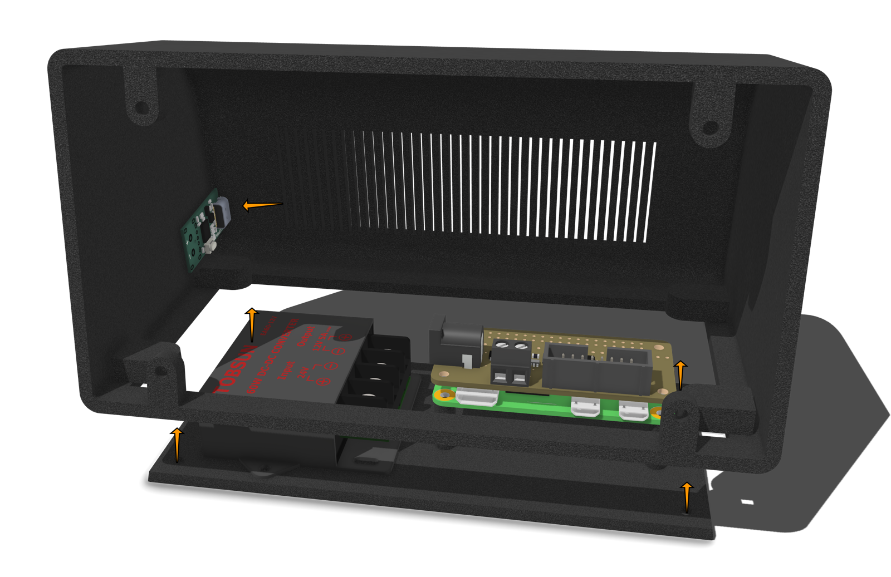

# 3D Printed Raspberry Pi Matrix Clock



## Hardware

- [Raspberry Pi Zero 2 W](https://www.raspberrypi.com/products/raspberry-pi-zero-2-w/)
- [Adafruit 64x32 RGB LED Matrix - 2.5mm pitch](https://www.adafruit.com/product/5036)
    - Can be replaced by any 64x32 Hub75 2.5mm pitch led matrix, they usually are the same dimensions and work the same way as the Adafruit one. Check Amazon or AliExpress.
- [Adafruit RGB Matrix Bonnet for Raspberry Pi](https://www.adafruit.com/product/3211)
- [Tobsun DC 12V/24V to 5V 10A Converter](https://www.amazon.com/VOLRANTISE-Converter-Voltage-Regulator-Transformer/dp/B09WZ9DC9W)
- [USB-C Decoy Fast Charge Trigger with screw terminal](https://www.amazon.com/AITRIP-Charging-Trigger-Detector-Terminal/dp/B098WPSMV9)
- [5.5mm x 2.1mm Barrel Jack Adapter](https://www.amazon.com/CENTROPOWER-Connectors-Pigtail-Adapter-Security/dp/B0BTHSDF4S)
- M3x6 Machine Screws (10 pcs)
- M2x4 Machine Screws (4 pcs)
- M3 Heated inserts (4 pcs)
- M2 Heated inserts (4 pcs)
- Black vinyl sticker (50-80% transparency)
- USB-C to USB-C cable
- 40W USB-C Power adapter

## 3D Printed Case

1. Print body and bottom plate using a 0.4 Nozzle and 0.2mm layer height in PLA
  - I recommend cutting the model in your slicer and printing it with a snug support.
  - If you've cut the model like me, use super glue to attach them back together.
2. Print diffuser using 0.2 Nozzle and 0.1mm layer height in PLA
  - Print the bottom 2 layers in white PLA (diffuser)
  - Print the top 20 layers in black PLA (grid)
  - ⚠️ The grid has a single 0.2mm wall so it's not possible to print with a 0.4 Nozzle.

  

## Assembly

1. Insert 4 M3 heated inserts using a soldering iron in designated spots in the main body.
  
2. Insert 4 M2 heated inserts in desginated spots for Raspberry Pi on the bottom plate.
  
3. Press the diffuser to the front of the matrix display. It should snap in place with a little bit of force.
  - Optionally stick a black vinyl sticker to the white part to make the screen dark.
4. Attach the matrix display to the front using 4 M3 machine screws.
  
5. Attach the Raspberry Pi to the mounting holes using 4 M2 screws and then attach the bonnet to it.
6. Screw the buck converter in place using 2 M3 screws from the bottom.
  
7. Set the output of the USB-C PD trigger to 20V according to it's instructions, and connect 2 wires from it's terminals to the buck converter's input
8. Connect a pigtail barrel jack adapter to the buck converter's output, and plug in the other end to the bonnet.
9. Connect bonnet's data and power cable to the LED Matrix according to manufacturer's instructions.
10. Carefully slide in the USB-C PD trigger into the designated spot on the back of the model.
11. Screw the bottom plate in using 4 M3 machine screws.
  

## Software

- I recommend installing [DietPi](https://dietpi.com) instead of the official OS. It's much faster.
- [Prepare your RPI for headless installation](https://dietpi.com/docs/install/) and remote ssh.

On your local machine:

1. Update `sync.config.json`
2. Run:

```bash
$ bun install
$ bun run build
$ bun run sync
```

3. SSH into your RPI and run `/root/clock`. This should run the program.
4. You can [setup a systemd service](https://domoticproject.com/creating-raspberry-pi-service/) to run it in the background.

## CAD Files

STEP and STL files are available in `cad` directory.
